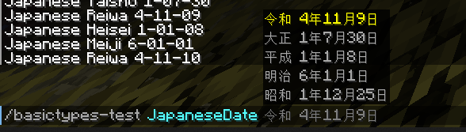

# Japanese Chronology Support
#### @Arg - Use Japanese Chronology to handle japanese date formats!

:::warning
Era `令和` / `Reiwa` is existing on java 13 and later.<br>
:::

| Supported Japanese date types   | Format             | Example                                       |
|---------------------------------|--------------------|-----------------------------------------------|
| JapaneseDate                    | `GGGG yyyy年MM月dd日` | `令和 4年11月8日`                                  |
| JapaneseEra                     | `GGGG`             | `令和`, `平成`, `昭和`, `大正`, `明治`                  |
| JapaneseDate **iso format** `*` | `GGGG yyyy-MM-dd`  | `Reiwa 0004-11-08`                            |
| JapaneseEra  **iso format** `*` | `GGGG`             | `Reiwa`, `Heisei`, `Showa`, `Taisho`, `Meiji` |

`*`
To use **iso format**, you need to add this line to your LiteCommands builder:
```java
    ...
    .argumentMultilevel(JapaneseDate.class, JapaneseDateArgument.isoFormat())
    .argumentMultilevel(JapaneseEra.class, JapaneseEraArgument.isoFormat())
    ...
```
    

Example:
```java
@Route(name = "japanese-date")
public class Example {

    private final DateTimeFormatter formatter = DateTimeFormatter.ofPattern("GGGG yyyy-MM-dd")
            .withChronology(JapaneseChronology.INSTANCE);

    @Execute
    void execute(@Arg JapaneseDate date) {
        System.out.println(formatter.format(date));
    }
    
}
```

> **/japanese-date 令和 4年11月8日**<br>
> Reiwa 0004-11-08

or if you use **iso format**:

> **/japanese-date Reiwa 0004-11-08**<br>
> Reiwa 0004-11-08

> In game:
